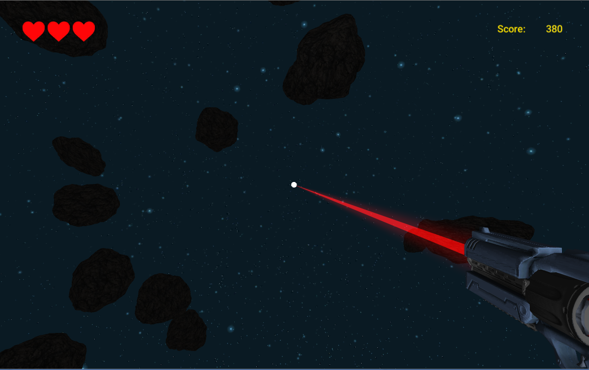

# Asteroids VR

#### VR Shooter

It is simple game inspired by  good, old Asteroids game from Atari. But hey, it's 3D and VR.

Goal: Survive.

To make this game i used some free assets to make it more fun:
*  [Asteroids](https://www.assetstore.unity3d.com/en/#!/content/84988)
*  [Laser sounds](https://www.assetstore.unity3d.com/en/#!/content/84988)
*  [Ouch sound](http://www.soundsboom.com/sound/601517/voice-prompts-male-voice-human-voice-clip-male-old-exclamations-ouch)
*  [Gun model](https://www.assetstore.unity3d.com/en/#!/content/84988)

I also used some elements from GoogleVR API to make this working. 
I didn't had VR set so it's only tested in Unity Editor.
It took me about 8-10 h. 

Creared by Hubert Morawski
Email: hubert.morawski2@gmail.com